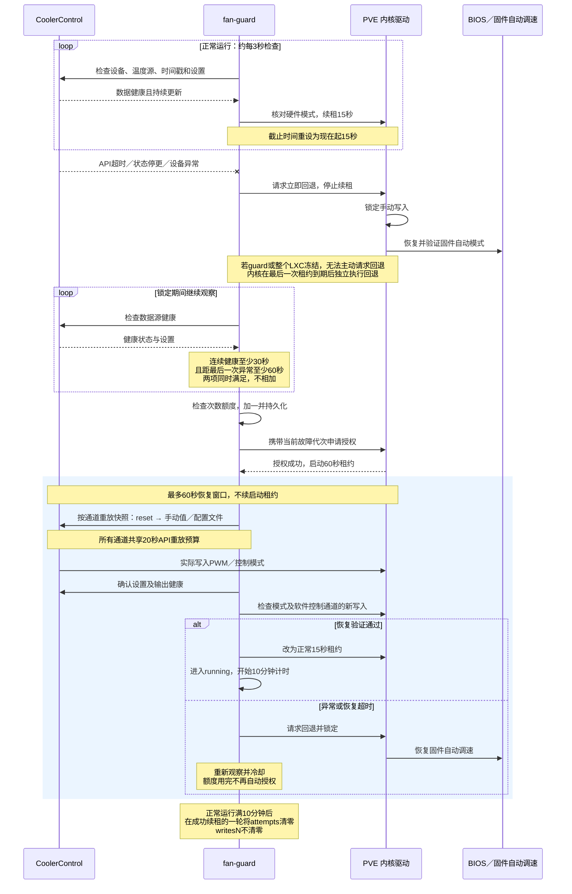

# fan-guard

为 CoolerControl 提供健康检查、设置快照恢复和内核 watchdog 续租的 Docker sidecar，在 PVE/LXC 故障时协同修改版 nct6687 驱动回退至 BIOS 自动调速。

## 项目来源与依赖

本项目以 Docker-Server 的 `/root/nas-app-data-docker/fan-control` 当前部署为基准提取。保留部署目录结构，镜像源码位于 `fan-guard/`；下文是该现场的运行手册。

- 依赖提供保护接口的修改版 nct6687 内核驱动；本仓库不包含内核驱动，也不适用于原版只读 hwmon 驱动。
- `config.example.json` 是从现场配置生成的示例；部署时复制为 `config.json` 并填写实际设备 UID。API 凭据需在目标机单独提供，本仓库不包含凭据。
- `compose.template.yaml` 是部署模板；`compose.yaml` 由 `start-fan-control.sh` 根据实际设备目录生成，不提交。
- `deploy/fan-control.openrc` 是现场 OpenRC 服务副本；路径固定为现有 LXC 部署位置，迁移到其他位置时需要调整。
- 本仓库未包含测试文件；此前现场验收不能代替其他主板或部署环境的验证。


本项目在 LXC 131 内运行 CoolerControl 和 fan-guard，保护 fan1、fan3、fan4。

## guard 的运行机制

### 各自负责什么

- **CoolerControl**：读取温度，执行手动转速或软件曲线，通过 PWM 接口控制风扇。
- **fan-guard**：检查 CoolerControl 和数据源是否健康、保存各通道设置快照、申请与续租，故障后协调恢复。它不计算风扇曲线，也不直接写 PWM。
- **PVE 内核驱动**：真正执行租约倒计时。租约到期先锁定手动写入，再恢复 BIOS／固件自动调速。因此 guard 或整个 LXC 停止／冻结后仍能回退；PVE 内核自身卡死不在保证范围内。

保护范围为 fan1、fan3、fan4。保护不等于强制软件接管：未管理通道可以一直由 BIOS 自动调速；即使全部通道未管理，guard 健康时仍可保持 active 并续租。

### 正常运行与健康检查

每轮检查 API、受控通道、配置文件引用的温度源及明确配置的必要温度源，确认温度有效、设备状态持续更新，并检查设备健康报告。API 能访问或进程还在，并不足以通过检查。

温度、转速或 PWM 数值保持不变是正常情况；检查的是设备状态时间戳是否继续前进。内部等待和超时使用单调时钟，不随系统校时跳动。若 API 时间戳倒退，则回退并重新观察。

正常运行时，当前硬件控制模式必须与 UI 设置一致，才续租并保存新快照。UI 设置已变化但硬件还没跟上时，暂不续租，也不覆盖旧快照，等待它在现有租约内完成；若一直不匹配，内核租约到期回退。

快照保存每个通道的手动百分比、配置文件 UID 或未管理状态；配置文件 UID 是引用，不是整条曲线内容的历史副本。恢复不依赖 Mode，也不改变未受控通道。

### 状态怎么变化

1. **locked（锁定观察）**：驱动禁止手动写入，风扇由 BIOS 自动。guard 每次启动都会先请求回退，不接着使用上次留下的租约。
2. **authorizing（可选的授权重试等待）**：仅当驱动返回 EBUSY、且重新核对仍安全锁定时进入；最多延迟重试一次，此时尚未获得租约。
3. **starting（恢复验证）**：按当前故障代次授权，同时获得60秒启动租约。通过 CoolerControl 通道 API 先 reset，再重新应用快照中的 profile 或 manual；已正确处于未管理的通道可跳过重复操作。
4. **running（正常续租）**：确认设置重放成功、输出健康且硬件模式匹配后，改为15秒正常租约。
5. **发现异常**：请求立即回退、停止续租，回到 locked。若请求本身失败，仍以已存在的内核租约到期为后备保护。驱动报告回退失败时禁止自动授权，需要人工检查，不能宣称已恢复 BIOS 自动。

这里的 starting、running 是 guard 自己的阶段；两者在驱动中都显示 active。active 只代表租约有效，不代表每个风扇都已进入软件控制。

### 故障与恢复时序图



这是故障恢复路径；首次启动且 attempts=0 时不额外等待60秒冷却。未管理通道保持自动，不要求新 PWM 写入。图中恢复 BIOS 自动以驱动回读验证成功为前提；回退失败时保持写入锁定、禁止自动授权。

### 每个时间的含义

以下是当前源码固定值，不是 config.json 中可随意调整的参数。

| 时间 | 从什么时候开始算 | 含义与到期行为 |
|---|---|---|
| **3秒：检查周期** | 每轮开始时 | 一轮用时不足3秒则补足等待；超过3秒就立即开始下一轮，不再额外睡3秒。实际间隔会受 API 和调度影响。 |
| **2秒：单次 API 请求超时** | 发起该请求时 | 传给 HTTP 客户端的超时上限；剩余批次预算不足2秒时采用更短值。请求超时按异常处理。它不是整个检查过程只花2秒的保证。 |
| **6秒：健康检查 API 批次预算** | 每轮健康快照开始时 | 本轮多个 API 调用共用预算；每次请求前、响应读取后检查。超预算则回退。同步网络调用可能使实际耗时超过预算，内核租约独立兜底。 |
| **6秒：状态停更阈值** | 最后一次观察到该设备时间戳前进时 | 在后续检查中发现至少6秒没前进，就判定停更并回退。按设备分别记录；不是要求温度或 PWM 每6秒变化。实际发现时刻取决于检查轮次。 |
| **15秒：正常租约** | 每次成功续租时 | 将内核截止时间重设为“现在起15秒”，不是在原截止时间上累加15秒。guard 消失后，按最后一次续租剩余时间触发回退，不一定还要等满15秒。 |
| **30秒：连续健康观察** | locked 阶段首次完整健康检查通过时 | 后续持续健康满30秒才允许尝试恢复。任何异常都会清除这段健康计时，重新累计。 |
| **60秒：恢复冷却** | 每次 guard 处理异常时 | 将最早恢复时间至少推到本次异常之后60秒。持续异常会不断把时间往后推；不是第一次报错后固定等60秒就必然恢复。 |
| **60秒：启动租约／恢复窗口** | 成功授权附近，重放设置之前 | 用于重放设置并验证实际软件接管。恢复阶段不会不断续这个租约；未完成就回退。若提前验证成功，立即改用15秒租约，不用等满60秒。 |
| **20秒：设置重放 API 批次预算** | 开始重放快照时 | 所有受控通道共享这一预算，不是每个通道20秒。它包含在上述60秒恢复窗口内，不额外相加；同样属于请求前后检查的预算。 |
| **3秒／15秒：授权 EBUSY 重试** | 首次授权被明确拒绝为 EBUSY 并核对安全后 | 至少等3秒，再在后续健康检查通过的轮次重试一次；15秒观察窗口内没有完成重试就回退。使用同一次已计数的恢复尝试，不增加额外尝试额度。 |
| **600秒（10分钟）：清零尝试次数** | 成功进入 running 时 | 没有再次回退的情况下，到达600秒后，在成功续租的一轮把 attempts 清零。若中间故障回退，重新进入 running 后重新计时；不是从容器启动时间算。 |

**30秒健康观察与60秒冷却同时进行，必须两个条件都满足，不是固定等待90秒。** 例如最后一次异常发生在0秒，3秒开始持续健康，健康观察约33秒满足，但冷却要到60秒；下一轮检查通过后才尝试恢复。若50秒又报错，冷却至少推到110秒，健康观察也重新开始。

首次启动且持久化 attempts=0 时，没有额外60秒初始冷却，只需连续健康30秒。若启动时 attempts>0，则从此次 guard 启动起还有60秒冷却；重启不会让它绕过恢复次数限制。

### 怎样确认“恢复了软件控制”

恢复前记录各通道的 writesN。恢复验证阶段：

- **手动或软件曲线通道**：必须进入手动控制模式，且自己的 writesN 比授权前增加；成功写入相同 PWM 值也计数，不要求数值变化。
- **未管理通道**：必须保持自动模式，不要求 PWM 写入增加。
- 同时确认 API 设置与恢复快照一致，预期的通道输出错误已经消失。锁定观察期间只容忍受控输出因锁定出现的预期错误，温度源异常不能豁免。

进入正常 running 后，不要求 writesN 持续增加。手动固定转速、恒温时没有新写入，不会仅因此回退。

### 三次限制和计数清零

attempts 是“恢复尝试次数”，在授权之前就加一并保存，包括后来成功的尝试；并非只统计失败。快照和该计数保存在 Docker 的 guard-state 卷内，重启容器不会清掉。

最多使用三次额度；第三次成功仍可继续正常运行，并在满足十分钟条件后清零。若第三次也失败，或尚未清零就再次故障，保持锁定自动模式，日志提示人工处理，不进行第四次自动授权。

**十分钟清零的是 attempts，不是驱动的 writes1、writes3、writes4。** writesN 是累计成功 PWM 请求数，不由 guard 定时清零。用于观察十分钟的 running_since 在内存中，不跨 guard 重启累计。

## 启动与配置

LXC 的 `/etc/init.d/fan-control` 已加入 OpenRC 开机启动，依赖 Docker。
它调用 `start-fan-control.sh`，检查保护掩码13、挂载和权限，找到当前 hwmon 目录，再从 `compose.template.yaml` 生成 `compose.yaml` 并启动容器。

- 修改容器部署设置：编辑 `compose.template.yaml`；`compose.yaml` 会在启动时重新生成。
- 修改 guard 设置：编辑 `config.json`。
- `coolercontrol-api-token` 是运行凭据，勿公开。
- `fan-guard/` 只保留运行源码和镜像构建文件。
- CoolerControl 设置及 guard 状态保存在 Docker 命名卷中。

PVE 必须先配置三通道保护、权限和 `/opt/fan-control/` 文件挂载；检查失败时启动脚本会拒绝启动。驱动重载后需停止再启动 LXC，重建挂载。

## 人工重置 attempts

在修复导致恢复失败的问题后，可把尝试额度重新置为0。**不要删除 attempts.json 或整个 guard-state 卷**，否则会丢失故障前的通道设置快照。下面只修改 attempts，保留快照和范围字段，也不会清零驱动 writesN 或解除驱动故障锁定。

以下命令在 **LXC 131 的终端**执行。Python 仅在临时 Docker 容器内运行，不在 PVE／LXC 主系统运行。

### 1. 停止两个风扇服务并确认自动回退

```sh
cd /root/nas-app-data-docker/fan-control
docker compose --env-file /dev/null -f compose.yaml stop fan-guard coolercontrol
cat /opt/fan-control/fan_control_status
```

预期 `state=locked manual_mask=0 failed_mask=0`。若仍 active，等待当前租约到期再读；若 failed 或 failed_mask 非零，先解决驱动回退问题，不要用重置次数绕过。停止期间风扇应处于固件自动模式。此路径要求已完成三通道 PVE 挂载迁移。

### 2. 清零次数，保留所有其他状态

整段复制执行；括号内启用遇错停止，不影响外层终端：

```sh
(
set -eu
cd /root/nas-app-data-docker/fan-control
GUARD_CONTAINER=$(docker compose --env-file /dev/null -f compose.yaml ps -a -q fan-guard)
[ -n "$GUARD_CONTAINER" ] || { echo '找不到guard容器，停止'; exit 1; }
[ "$(docker inspect --format '{{.State.Running}}' "$GUARD_CONTAINER")" = false ] || { echo 'guard仍在运行，先停止'; exit 1; }
GUARD_STATE_VOLUME=$(docker inspect --format '{{range .Mounts}}{{if eq .Destination "/state"}}{{if eq .Type "volume"}}{{.Name}}{{end}}{{end}}{{end}}' "$GUARD_CONTAINER")
[ -n "$GUARD_STATE_VOLUME" ] || { echo '未找到已有状态卷，停止'; exit 1; }
docker volume inspect "$GUARD_STATE_VOLUME" >/dev/null
GUARD_IMAGE=$(docker inspect --format '{{.Image}}' "$GUARD_CONTAINER")
docker run --rm -i --network none --read-only --cap-drop ALL \
  --security-opt no-new-privileges:true \
  --mount "type=volume,src=$GUARD_STATE_VOLUME,dst=/state" \
  --entrypoint python3 "$GUARD_IMAGE" -B - <<'PY'
import fcntl
import json
import os
from pathlib import Path

with Path('/state/keeper.lock').open('a') as lock:
    fcntl.flock(lock, fcntl.LOCK_EX | fcntl.LOCK_NB)
    path = Path('/state/attempts.json')
    saved = json.loads(path.read_text())
    old = saved['attempts']
    if type(old) is not int or not 0 <= old <= 3:
        raise RuntimeError('attempts字段异常，停止并人工检查')
    saved['attempts'] = 0
    tmp = path.with_suffix('.reset.tmp')
    with tmp.open('w') as output:
        json.dump(saved, output)
        output.flush()
        os.fsync(output.fileno())
    os.replace(tmp, path)
    fd = os.open(path.parent, os.O_RDONLY)
    try:
        os.fsync(fd)
    finally:
        os.close(fd)
    print(f'attempts: {old} -> 0；其他状态字段保持不变')
PY
)
```

此命令从现有 guard 容器查找实际状态卷和镜像，不猜卷名；临时容器只挂载状态卷，不挂载 sysfs、API凭据或 Docker socket。它取得与 guard 相同的文件锁，再原子替换 JSON，避免并发写坏状态。如果文件不存在或锁被占用，命令报错停止，不自动创建一份空快照。

预期输出 `attempts: 3 -> 0；其他状态字段保持不变`（原值也可能是0、1或2）。仅当此步骤成功，才继续启动。

### 3. 通过启动检查重新运行

```sh
rc-service fan-control restart
docker compose --env-file /dev/null -f compose.yaml logs --tail=60 fan-guard
```

使用 restart 是因为第1步直接停止 Docker 容器后，OpenRC 可能仍记录服务为 started。此命令会重新执行挂载与掩码检查。

重置后仍要通过至少30秒连续健康观察；不会立即接管。开始下一次授权尝试时，attempts 会从0变成1，这是正常计数，不代表重置失败。若再次异常，仍按60秒冷却和最多三次额度处理；不要循环清零掩盖持续故障。

## 常用命令（在 LXC 执行）

```sh
# 启动 / 停止 / 重启；停止后风扇交回固件自动
rc-service fan-control start
rc-service fan-control stop
rc-service fan-control restart

# 查看日志
cd /root/nas-app-data-docker/fan-control
docker compose --env-file /dev/null -f compose.yaml logs --tail=60 fan-guard

# 修改 guard 源码后构建，再通过启动检查重启
docker compose --env-file /dev/null -f compose.yaml build fan-guard
rc-service fan-control restart
```

容器使用 `on-failure` 重启策略。LXC 开机由 OpenRC 启动；若单独重启 Docker，随后执行 `rc-service fan-control restart`。不要直接运行 compose up 绕过挂载检查。不需要手动 export 环境变量。
